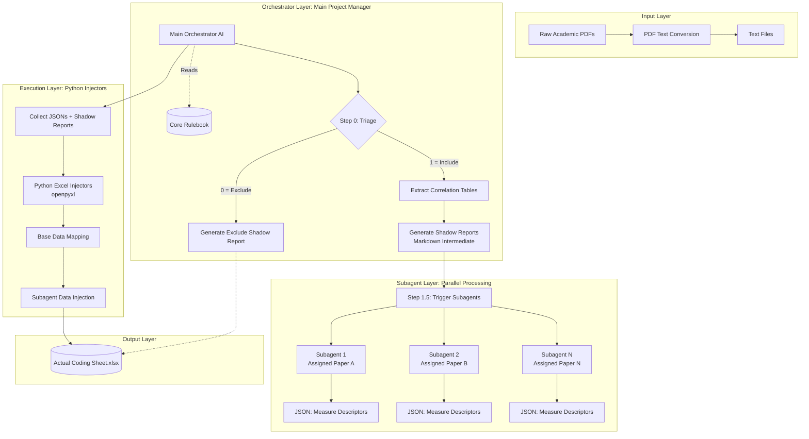

# Automated Meta-Analysis System Architecture (Generalized Model)

This document provides a comprehensive overview of the multi-agent automated extraction harness. The system is designed to prevent AI hallucinations, manage context limits, and ensure 100% data fidelity for meta-analytic coding. 

It is divided into two parts: **1. The General Workflow Architecture** and **2. The Detailed Rulebook Network**.

---

## 1. General Workflow Architecture Diagram

The following diagram illustrates how raw PDFs are processed through the AI agents and Python scripts to produce the final Excel dataset.



### Component Breakdown
1. **The Orchestrator (Main AI):** Acts as the Project Manager. It parses the text, makes the initial Inclusion/Exclusion judgment, and creates **Shadow Reports** (a markdown staging area where data is verified before touching Excel).
2. **The Subagent Layer (Parallel Micro-Workers):** To solve context-window exhaustion, the Orchestrator spawns isolated Subagents (`Subagent 1`, `Subagent 2`, etc.). Each subagent is assigned a specific paper to search the "Measures" section for precise scale details (Items, Min, Max, Source), returning clean JSON data.
3. **The Execution Layer (Python Injection):** AI models can make "off-by-one" column errors in Excel. To solve this, the Orchestrator writes mathematical Python scripts using exact zero-indexed column maps to inject the data perfectly into the final spreadsheet.

---

## 2. Detailed Rulebook Network Architecture

The "Core Rulebook" shown in the diagram above is not a single prompt, but an interconnected network of Markdown files. The orchestrator agent and its subagents are hard-wired to consult these documents based on the phase of extraction.

```mermaid
graph TD
    %% Base Philosophy Layer
    R0[00_core_process.md<br/><b>Core Philosophy</b><br><i>"Zero Guesswork & Stop on Ambiguity"</i>]
    
    %% Process Layer (The Pipeline)
    R3[03_automated_workflow.md<br/><b>The Orchestrator Pipeline</b>]
    R0 --> R3
    
    %% Data Type Handlers
    subgraph Data Type Resolutions
        R1[01_dyadic_data_rules.md<br/><b>Dyadic/Multi-source</b><br><i>Anchor Identity Mapping</i>]
        R2[02_sem_and_latent_rules.md<br/><b>Latent Variables</b><br><i>Handling SEM composites</i>]
        R6[06_non_individual_anchors.md<br/><b>Macro Levels</b><br><i>Team/Org Level Data</i>]
    end
    
    R3 -- "Step 1: Analyzes Data Structure" --> R1
    R3 -- "Step 1: Analyzes Data Structure" --> R2
    R3 -- "Step 1: Analyzes Data Structure" --> R6
    
    %% Edge Case Handlers
    subgraph Exception Handlers
        R4[04_general_exceptions.md<br/><b>General Edge Cases</b><br><i>Math errors & Missing N</i>]
        R7[07_scale_oddities.md<br/><b>Measurement Oddities</b><br><i>Missing alphas, unknown scales</i>]
    end
    
    R1 -. "Conflicts trigger" .-> R4
    R2 -. "Conflicts trigger" .-> R4
    R3 -- "Step 1.5: Subagent Scale Extraction" --> R7
    
    %% Output Handlers
    R8[08_data_entry_formatting.md<br/><b>Formatting Rules</b><br><i>Excel Column IDs, '999' flags</i>]
    
    R3 -- "Step 2: Excel Injection" --> R8
    R4 -. "Forces '999' output" .-> R8
    R7 -. "Forces '999' output" .-> R8
    
    %% Metacognition Layer
    R5[05_document_management.md<br/><b>Rulebook Governance</b><br><i>How the AI self-updates</i>]
    
    R4 -. "[UNRECOGNIZED PARADIGM]<br>resolved by User" .-> R5
    R5 --> R0
    R5 --> R1
```

### Component Breakdown
1. **The Core Directives:** `00_core_process.md` bans the AI from guessing missing values (enforcing the `999` rule). `03_automated_workflow.md` dictates the strict step-by-step pipeline.
2. **Data Structure Handlers:** Depending on the paper's methodology, the AI opens specific rules to handle multi-rater data (`01`), structural equation models (`02`), or team-level boundaries (`06`).
3. **Exception & Ambiguity Handlers:** If the Subagents find logic breaks or missing measurement scales, they consult `04` and `07`. If a situation breaks all rules, they trigger the `[UNRECOGNIZED PARADIGM]` flag and halt for human intervention.
4. **Output & Self-Learning:** `08` provides the exact Excel map. If a human resolves an unrecognized paradigm, `05` instructs the AI on how to rewrite its own rulebook to learn from the human feedback.
