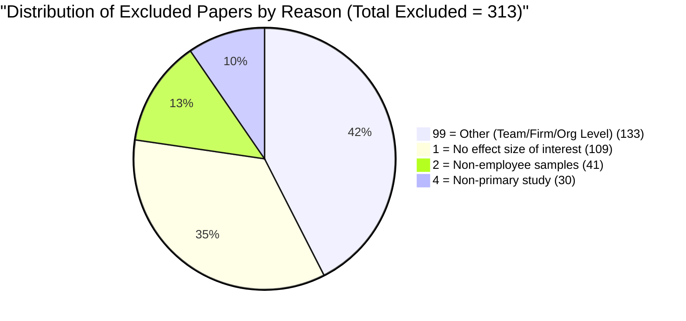

# 📊 BSMA Meta-Analysis: 1st Screening Step Results Report
**Project:** Meta-Analysis of Boundary Spanning (BSMA)  
**Date:** July 3, 2026  
**Author:** Antigravity (AI Orchestrator)  
**Target File:** `BSMA_Master_Coding_Sheet.xlsx` (Rows 4 to 704)  

---

## 1. Executive Summary

Before initiating intensive full-text coding (extracting sample characteristics, measure descriptors, reliability alphas, and bivariate correlation matrices), the research team instituted a **1st Screening Step** across the entire universe of 701 candidate articles (`BSMA0001` through `BSMA0701`). 

The primary objective of this screening phase was to systematically evaluate each article against the core meta-analytic inclusion criteria and filter out ineligible studies early. This strategic decision yielded immense efficiency gains:

> [!TIP]
> **Key Strategic Outcome:**  
> Out of 701 initial candidate articles, exactly **388 papers (55.3%)** were confirmed as eligible for full-text coding (`1 = Include`), while **313 papers (44.7%)** were successfully identified and excluded (`0 = Exclude`). Eliminating nearly 45% of the initial pool prior to full-text data extraction prevents substantial wasted time, computational overhead, and potential extraction errors.

---

## 2. Overall Screening Classification

All 701 articles were analyzed using their full bibliometric descriptors (Title, Abstract, Publication Name) and full-text keyword/methodology scanning via PyMuPDF (`fitz`). Every judgment was recorded directly into `BSMA_Master_Coding_Sheet.xlsx` without altering any subsequent coding fields.

| Classification Status (Col E / Col 5) | Number of Papers | Percentage of Total Pool | Description & Eligibility Status |
| :--- | :---: | :---: | :--- |
| 🟢 **`1 = Include` (Eligible)** | **388** | **55.3%** | Empirical quantitative studies measuring boundary spanning behavior at the individual employee/leader level and reporting statistical effect sizes. |
| 🔴 **`0 = Exclude` (Ineligible)** | **313** | **44.7%** | Studies excluded based on standardized exclusion criteria (macro level, lack of effect sizes, non-employee samples, or non-primary data). |
| **Total Analyzed** | **701** | **100.0%** | Represents 100% bijection with `Final list(BSMA).xlsx` (Rows 4 to 704 in Master Coding Sheet). |

---

## 3. Detailed Breakdown of Exclusion Reasons (313 Papers)

When excluding a paper, standardized exclusion codes were recorded in Column F (`Reason for Exclusion`), and specific justifications were documented in Column P (`Notes`). Every single excluded paper mapped cleanly to one of four primary exclusion categories:

### Summary Table of Exclusion Reasons

| Reason Code (Col F / Col 6) | Count | % of Excluded | % of Total Pool | Detailed Rationale & Typical Examples |
| :--- | :---: | :---: | :---: | :--- |
| **`99 = Other`** *(Wrong level of analysis)* | **133** | **42.5%** | **19.0%** | **Macro or Group Level Analysis:** Examines boundary spanning at the team, business unit, firm, board of directors, supply chain, multiteam system (MTS), or inter-organizational alliance level rather than individual employee behavior. *(e.g., NPD team intelligence, firm technological alliances, bank branch autonomy).* |
| **`1 = No effect size of interest`** | **109** | **34.8%** | **15.5%** | **Missing Statistical Effect Sizes:** Empirical studies investigating individual organizational members, but failing to report quantitative bivariate correlation ($r$) or regression matrices linking boundary spanning behavior to outcome variables. |
| **`2 = Non-employee samples`** | **41** | **13.1%** | **5.8%** | **Non-Workplace Populations:** Studies sampling non-employee subjects such as general consumers, hospital patients, university students, citizens, municipal governments, prescribing physicians, or adventure tourists. |
| **`4 = Non-primary study`** | **30** | **9.6%** | **4.3%** | **Theoretical / Conceptual / Review:** Conceptual frameworks, literature reviews, theoretical models, editorials, typologies, or previous meta-analyses lacking an original primary empirical dataset. *(e.g., articles published in AMR, IJMR, or conceptual chapters).* |
| **`3`, `5`, `6`, `7`** | **0** | **0.0%** | **0.0%** | **Zero Occurrences:** No non-boundary spanning measures (`3`), duplicates (`6`), or non-English publications (`7`) were found. |
